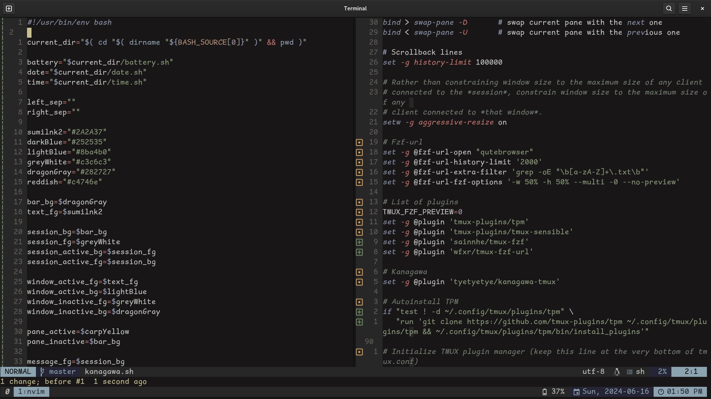

# kanagawa-tmux
***Fork of [kanagawa-tmux](https://github.com/tyetyetye/kanagawa-tmux)***

## Install

Add to the end of tmux.conf
```
# Kanagawa #
set -g @plugin 'furgelisherpa/kanagawa-tmux'

# Autoinstall TPM
if "test ! -d ~/.config/tmux/plugins/tpm" \
   "run 'git clone https://github.com/tmux-plugins/tpm ~/.config/tmux/plugins/tpm && ~/.config/tmux/plugins/tpm/bin/install_plugins'"
run '~/.config/tmux/plugins/tpm/tpm'
```

Install plugin with

```
tmux-prefix I 
```

## Screenshot

Original


Forked

